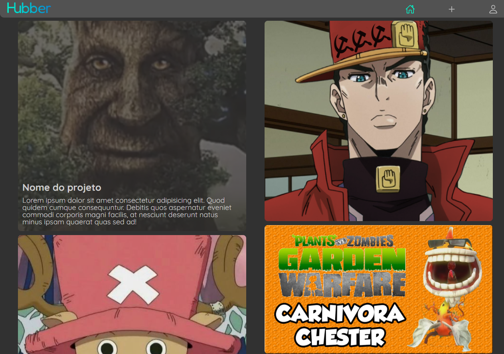

# Hubber
Rede social com o intuito de divulgar projetos pessoais e até mesmo profissionais
## Autores
- `Henrique Soubhia` *
- Thiago Mendes
- Francisco Ferrara
- Eduardo Gomes
- Gabriel Francisco
### Logo 

### Feed

